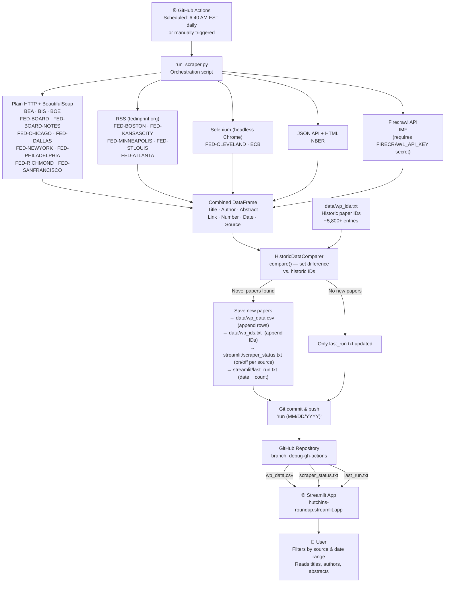

# Data Flow: Websites → Streamlit

## Key files updated each run

| File | What changes |
|---|---|
| `data/wp_data.csv` | New paper rows appended |
| `data/wp_ids.txt` | New paper IDs appended |
| `streamlit/scraper_status.txt` | `on`/`off` per scraper |
| `streamlit/last_run.txt` | Run date + new paper count |
